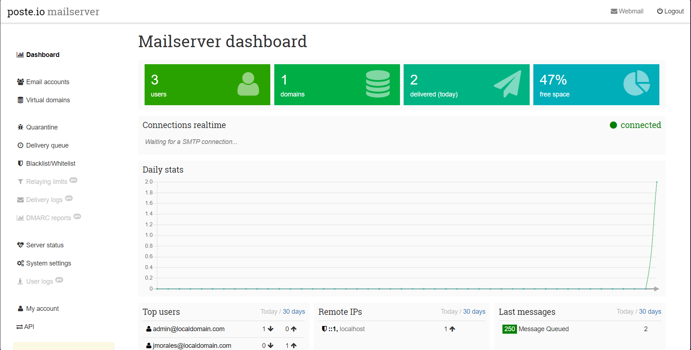
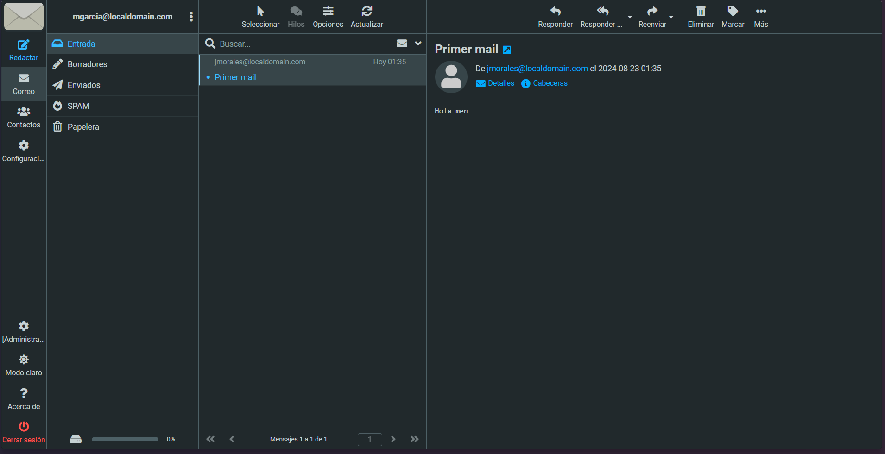

# <div align="center">Servidor de Correo con Docker 🚀</div>

Este proyecto configura un servidor de correo local utilizando `poste.io` en un contenedor Docker, junto con un contenedor de Fedora personalizado para propósitos adicionales. El proyecto está diseñado para funcionar en un entorno local y es ideal para pruebas y desarrollos internos.

## <div align="center">Estadísticas del Repositorio 📊</div>

<div align="center">
  
  
  
  
  
  
</div>

## Requisitos Previos 💻

Antes de comenzar, asegúrate de tener instalados los siguientes requisitos:

- [Docker](https://docs.docker.com/get-docker/)
- [Docker Compose](https://docs.docker.com/compose/install/)

## Instrucciones de Ejecución 🛠️

### 1. Clonar el Repositorio

Clona este repositorio en tu máquina local:

```bash
git clone https://github.com/jmorales01/mailserver.git
cd mailserver
```

### 2. Configurar el Archivo hosts

Añade la siguiente línea al archivo `hosts` de tu sistema para poder acceder al servidor de correo mediante un nombre de dominio local:
La IP, tiene que ser la ip de tu dispositivo local que la puedes optener con el comando `ipconfig` en tu CMD.

```bash
192.168.18.4    mail.localdomain
# Ejecuta este comando directo en tu CMD (Windows)
echo 192.168.18.4    mail.localdomain >> C:\Windows\System32\drivers\etc\hosts
```
> **Note:** Asegúrate de que `192.168.18.4` sea la IP local de tu máquina que ejecutará el contenedor, puedes revisarlo con el comando `ipconfig` en tu CMD.


### 3. Construir y Ejecutar los Contenedores

Construye y lanza los contenedores utilizando Docker Compose:
```bash
docker-compose up -d
```

### 4. Acceso a la Interfaz de Administración de `poste.io`
Abre un navegador web y ve a: [**https://mail.localdomain**](https://mail.localdomain/)


## Estructura del Proyecto 🗂️

```text
/path/to/project/
│
├── Dockerfile             # Dockerfile para construir la imagen Fedora
├── docker-compose.yml     # Configuración de Docker Compose
├── mail/                  # Datos persistentes de poste.io
└── datos/                 # Datos compartidos del contenedor Fedora
```


## Donaciones 💰

Si te gusta mi trabajo y quieres apoyarme, ¡considera hacer una donación! Tu apoyo es muy apreciado. 🙏

[](https://paypal.me/jmoralesv24?country.x=PE&locale.x=es_XC)

## License 📄

This project is licensed under the MIT License. See the [LICENSE](LICENSE) file for details.

---

## <div align="center">¡Gracias por visitar mi repositorio 🌟🧑‍💻</div>

---

<div align="center" >
  
  
</div>